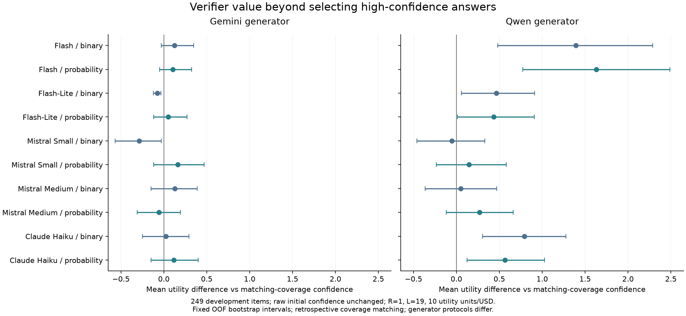

# Gemini／Qwen：原始 confidence、verifier 更新与同覆盖率对照

日期：2026-10-06。所有候选和原始 confidence 保持冻结；本次只补齐开发集 Qwen 的缺失 verifier 请求。未校准初始概率、未生成新候选、未读取 Diamond 评估答案。

## 主要发现

1. **Gemini：增益仍未确认。** 新缓存加入后，Gemini 全部分析结果与前一轮完全一致。在同覆盖率对照下，没有一个单 verifier 臂的正向平均效用差区间完全高于零。
2. **Qwen：Flash 信号有明确的开发集改善迹象。** 在共同有效的 245 题上，概率更新的 Brier 从 0.3029 降至 0.1400，差值约 −0.1629，描述性 95% 区间 [−0.2055, −0.1219]。这是不校准初始 confidence 的结果。
3. **Qwen 的改善不只是减少输出。** Flash 概率策略输出 158 个答案，其中 20 个错误；相同覆盖率 confidence 对照的期望错误数约 40.52。扣除查询成本后，平均效用差约 +1.632，区间 [+0.772, +2.488]；五种折分下差值均为正，范围约 +1.378 至 +1.898。同分对照的小数计数表示随机选择的期望。
4. **目前仍未达到高置信度输出目标。** Qwen 原始门槛输出 154 个、错误 38 个；Flash 概率验证后输出正确率为 138/158≈87.3%，低于名义 95%。主惩罚 19 下所有单 verifier 臂的平均效用仍低于零；Flash 概率臂为 −0.9879。相对基线改善不等于优于全部弃答。
5. **继续保留条件依赖问题。** Qwen 正确候选内部，Flash 信号与原始 confidence 的样本相关约 0.513；其错误候选内部约 0.003。不能据此证明独立，也不能把同家族与跨家族的差异解释成确定的因果关系。

结果支持继续把 Qwen＋Flash 概率信号作为重点研究组合，同时保留二元报告对照。尚未据此确定最终三个 verifier，也未更改似然模型或停止规则。接下来应在保留原始初始概率的约束下，明确依赖处理与失效返回如何进入价值表，再做独立评估。

## 数据范围与固定方法

开发集为 Main 去掉全部 Diamond 后再剔除重复选项题的 249 题；另外在排除最初 50 道协议试验题后的 199 题重复分析，两者重叠。196 道过滤后 Diamond 评估题的候选保持冻结，本轮未评分或调参。

每个 generator 分别在三折训练部分估计 verifier 似然和平均请求成本；验证部分从原始 confidence 出发更新。五种固定折分全保留；主种子 20261005。二元两箱／概率三等宽箱、Laplace=1、grid=1001；主奖励 1、错误惩罚 19、成本系数 10 效用单位/USD；惩罚 99 单独作为敏感性结果。每臂只有一个 verifier，不串联二元和概率报告，不选最终三个 verifier。

同覆盖率对照在每个验证折按原始 confidence 排序，匹配该臂输出数量；边界同分用均匀随机选择的期望，不用标签打破平局。这是事后的风险—覆盖率诊断，尚不是独立训练的可部署门槛。

## 补采与费用

- 缺失请求目标 758；已返回 758；本地新采集账本成功计价 758 次。
- 已返回无效信号：`{"gemini_lite:probability:invalid_json": 1}`；保留原样，不补发。
- 本次 provider token 用量费用估算 **USD 1.045169**；本地额度 USD 5，包含在原 USD 200 总预算与 USD 20 信号研究额度内。
- 计费项目 `llm-applications-490420`，计费启用状态经只读 API 核实。费用是用量推算，不是确认账单；历史未能完整计价的响应仍保留预留额，不按免费处理。
- 本地实验各账本已结算用量估算累计 USD 7.617028，另有历史未完整计价的预留额 USD 0.336451。两者不是整个云项目的确认账单；本次新增账本已全部计价，无剩余预留。
- 旧候选、旧响应的哈希保持一致；本次缓存另存，旧实验结果不覆盖。不同日期的托管模型别名可能发生服务端版本变化，日志保存返回元数据，但不能证明权重完全不变。

## Gemini

### 全部开发题

总题数 249；有效 generator 答案和 confidence 247；十臂共同有效预测 243。策略分母使用全部题目；概率误差只在共同有效样本比较。

原始门槛 0.95：输出 190 个，正确 171、错误 19，平均效用 -0.7631。全部弃答效用为 0。

| 信号 | 原始 Brier | 更新 Brier | ΔBrier 及描述性 95% 区间 | 输出／错误 | 查询数 | 平均效用 | 相对同覆盖率 confidence 的效用差及区间 |
|---|---:|---:|---|---|---:|---:|---|
| Flash 二元 | 0.1246 | 0.1266 | +0.0020 [-0.0074, +0.0122] | 188／17 | 130 | -0.6189 | +0.1238 [-0.0287, +0.3448] |
| Flash 概率 | 0.1246 | 0.1171 | -0.0075 [-0.0232, +0.0070] | 187／17 | 188 | -0.6270 | +0.1036 [-0.0510, +0.3227] |
| Flash-Lite 二元 | 0.1246 | 0.1252 | +0.0007 [-0.0008, +0.0021] | 186／19 | 43 | -0.7817 | -0.0766 [-0.1242, -0.0340] |
| Flash-Lite 概率 | 0.1246 | 0.1270 | +0.0024 [-0.0006, +0.0055] | 184／17 | 69 | -0.6311 | +0.0487 [-0.1186, +0.2716] |
| Mistral Small 二元 | 0.1246 | 0.1253 | +0.0007 [-0.0007, +0.0021] | 152／15 | 69 | -0.5945 | -0.2861 [-0.5664, -0.0285] |
| Mistral Small 概率 | 0.1246 | 0.1247 | +0.0002 [-0.0019, +0.0022] | 165／12 | 125 | -0.3014 | +0.1633 [-0.1185, +0.4708] |
| Mistral Medium 二元 | 0.1246 | 0.1242 | -0.0004 [-0.0011, +0.0003] | 152／10 | 69 | -0.1931 | +0.1262 [-0.1479, +0.3903] |
| Mistral Medium 概率 | 0.1246 | 0.1259 | +0.0013 [+0.0001, +0.0034] | 166／14 | 85 | -0.4583 | -0.0590 [-0.3108, +0.1920] |
| Claude Haiku 二元 | 0.1246 | 0.1247 | +0.0001 [-0.0018, +0.0019] | 152／11 | 69 | -0.2767 | +0.0243 [-0.2501, +0.2915] |
| Claude Haiku 概率 | 0.1246 | 0.1278 | +0.0032 [+0.0001, +0.0065] | 168／13 | 69 | -0.3766 | +0.1157 [-0.1502, +0.3997] |

负的 ΔBrier 表示概率误差降低；正的同覆盖率效用差表示扣除验证成本后更有利。区间来自固定 OOF 结果重采样，未包含重拟合、同分实际抽样或多臂筛选不确定性。

### 排除早期 50 题

总题数 199；有效 generator 答案和 confidence 197；十臂共同有效预测 193。策略分母使用全部题目；概率误差只在共同有效样本比较。

原始门槛 0.95：输出 151 个，正确 140、错误 11，平均效用 -0.3467。全部弃答效用为 0。

| 信号 | 原始 Brier | 更新 Brier | ΔBrier 及描述性 95% 区间 | 输出／错误 | 查询数 | 平均效用 | 相对同覆盖率 confidence 的效用差及区间 |
|---|---:|---:|---|---|---:|---:|---|
| Flash 二元 | 0.1054 | 0.1082 | +0.0028 [-0.0070, +0.0136] | 150／10 | 97 | -0.2591 | +0.0768 [-0.0246, +0.2663] |
| Flash 概率 | 0.1054 | 0.0961 | -0.0092 [-0.0262, +0.0058] | 149／10 | 149 | -0.2690 | +0.0531 [-0.0571, +0.2503] |
| Flash-Lite 二元 | 0.1054 | 0.1090 | +0.0036 [+0.0003, +0.0079] | 149／11 | 63 | -0.3614 | -0.0363 [-0.0759, -0.0043] |
| Flash-Lite 概率 | 0.1054 | 0.1085 | +0.0031 [-0.0044, +0.0106] | 147／10 | 78 | -0.2728 | +0.0306 [-0.0897, +0.2128] |
| Mistral Small 二元 | 0.1054 | 0.1059 | +0.0005 [-0.0012, +0.0024] | 120／6 | 51 | -0.0001 | +0.0072 [-0.2347, +0.2309] |
| Mistral Small 概率 | 0.1054 | 0.1029 | -0.0025 [-0.0074, +0.0023] | 133／6 | 117 | 0.0651 | +0.2150 [-0.0277, +0.4944] |
| Mistral Medium 二元 | 0.1054 | 0.1056 | +0.0002 [-0.0029, +0.0034] | 124／7 | 56 | -0.0808 | -0.0242 [-0.2940, +0.2379] |
| Mistral Medium 概率 | 0.1054 | 0.1083 | +0.0030 [+0.0003, +0.0062] | 127／8 | 82 | -0.1664 | -0.0552 [-0.3744, +0.2682] |
| Claude Haiku 二元 | 0.1054 | 0.1061 | +0.0008 [-0.0038, +0.0053] | 123／5 | 56 | 0.1118 | +0.1671 [-0.0728, +0.4252] |
| Claude Haiku 概率 | 0.1054 | 0.1097 | +0.0043 [-0.0008, +0.0095] | 135／7 | 51 | -0.0319 | +0.1456 [-0.0999, +0.4470] |

负的 ΔBrier 表示概率误差降低；正的同覆盖率效用差表示扣除验证成本后更有利。区间来自固定 OOF 结果重采样，未包含重拟合、同分实际抽样或多臂筛选不确定性。

惩罚 99 的原始基线：输出 65 个、错误 3 个，平均效用 -0.9438。完整各臂与五种折分结果均保存到 JSON，未挑最优折分。

## Qwen

### 全部开发题

总题数 249；有效 generator 答案和 confidence 249；十臂共同有效预测 245。策略分母使用全部题目；概率误差只在共同有效样本比较。

原始门槛 0.95：输出 154 个，正确 116、错误 38，平均效用 -2.4337。全部弃答效用为 0。

| 信号 | 原始 Brier | 更新 Brier | ΔBrier 及描述性 95% 区间 | 输出／错误 | 查询数 | 平均效用 | 相对同覆盖率 confidence 的效用差及区间 |
|---|---:|---:|---|---|---:|---:|---|
| Flash 二元 | 0.3029 | 0.1708 | -0.1321 [-0.1693, -0.0947] | 162／25 | 207 | -1.3726 | +1.3920 [+0.4823, +2.2873] |
| Flash 概率 | 0.3029 | 0.1400 | -0.1629 [-0.2055, -0.1219] | 158／20 | 207 | -0.9879 | +1.6318 [+0.7718, +2.4883] |
| Flash-Lite 二元 | 0.3029 | 0.2765 | -0.0263 [-0.0424, -0.0104] | 140／28 | 153 | -1.6962 | +0.4672 [+0.0572, +0.9120] |
| Flash-Lite 概率 | 0.3029 | 0.2764 | -0.0265 [-0.0431, -0.0109] | 136／27 | 153 | -1.6331 | +0.4362 [+0.0134, +0.9069] |
| Mistral Small 二元 | 0.3029 | 0.3009 | -0.0020 [-0.0038, -0.0001] | 83／19 | 109 | -1.1929 | -0.0518 [-0.4624, +0.3297] |
| Mistral Small 概率 | 0.3029 | 0.2993 | -0.0035 [-0.0074, +0.0003] | 122／27 | 109 | -1.6789 | +0.1477 [-0.2337, +0.5811] |
| Mistral Medium 二元 | 0.3029 | 0.3026 | -0.0002 [-0.0009, +0.0004] | 88／19 | 109 | -1.1733 | +0.0510 [-0.3662, +0.4689] |
| Mistral Medium 概率 | 0.3029 | 0.3014 | -0.0015 [-0.0052, +0.0023] | 93／17 | 115 | -0.9927 | +0.2692 [-0.1202, +0.6627] |
| Claude Haiku 二元 | 0.3029 | 0.2908 | -0.0121 [-0.0205, -0.0039] | 112／16 | 120 | -0.8417 | +0.7912 [+0.3054, +1.2777] |
| Claude Haiku 概率 | 0.3029 | 0.2850 | -0.0178 [-0.0297, -0.0069] | 123／22 | 140 | -1.2875 | +0.5658 [+0.1222, +1.0266] |

负的 ΔBrier 表示概率误差降低；正的同覆盖率效用差表示扣除验证成本后更有利。区间来自固定 OOF 结果重采样，未包含重拟合、同分实际抽样或多臂筛选不确定性。

### 排除早期 50 题

总题数 199；有效 generator 答案和 confidence 199；十臂共同有效预测 195。策略分母使用全部题目；概率误差只在共同有效样本比较。

原始门槛 0.95：输出 124 个，正确 96、错误 28，平均效用 -2.1910。全部弃答效用为 0。

| 信号 | 原始 Brier | 更新 Brier | ΔBrier 及描述性 95% 区间 | 输出／错误 | 查询数 | 平均效用 | 相对同覆盖率 confidence 的效用差及区间 |
|---|---:|---:|---|---|---:|---:|---|
| Flash 二元 | 0.2879 | 0.1533 | -0.1346 [-0.1778, -0.0938] | 121／11 | 154 | -0.5117 | +1.6834 [+0.8722, +2.5330] |
| Flash 概率 | 0.2879 | 0.1262 | -0.1617 [-0.2097, -0.1149] | 137／16 | 180 | -0.9371 | +1.5403 [+0.5431, +2.6117] |
| Flash-Lite 二元 | 0.2879 | 0.2573 | -0.0307 [-0.0514, -0.0116] | 115／21 | 123 | -1.5421 | +0.4561 [+0.0499, +0.9509] |
| Flash-Lite 概率 | 0.2879 | 0.2324 | -0.0555 [-0.0845, -0.0283] | 113／20 | 124 | -1.4528 | +0.4951 [+0.0627, +1.0224] |
| Mistral Small 二元 | 0.2879 | 0.2880 | +0.0001 [-0.0025, +0.0026] | 80／21 | 87 | -1.7087 | -0.4443 [-0.8609, -0.0562] |
| Mistral Small 概率 | 0.2879 | 0.2837 | -0.0042 [-0.0103, +0.0014] | 98／17 | 87 | -1.2162 | +0.4160 [-0.0383, +0.9101] |
| Mistral Medium 二元 | 0.2879 | 0.2875 | -0.0004 [-0.0017, +0.0008] | 81／19 | 87 | -1.5031 | -0.2537 [-0.7025, +0.2185] |
| Mistral Medium 概率 | 0.2879 | 0.2835 | -0.0044 [-0.0087, +0.0000] | 74／11 | 108 | -0.7345 | +0.3838 [-0.0420, +0.7975] |
| Claude Haiku 二元 | 0.2879 | 0.2722 | -0.0157 [-0.0260, -0.0058] | 100／14 | 108 | -0.9119 | +0.7688 [+0.1233, +1.4292] |
| Claude Haiku 概率 | 0.2879 | 0.2758 | -0.0121 [-0.0270, +0.0012] | 101／15 | 115 | -1.0150 | +0.6730 [+0.1953, +1.2016] |

负的 ΔBrier 表示概率误差降低；正的同覆盖率效用差表示扣除验证成本后更有利。区间来自固定 OOF 结果重采样，未包含重拟合、同分实际抽样或多臂筛选不确定性。

惩罚 99 的原始基线：输出 1 个、错误 1 个，平均效用 -0.3976。完整各臂与五种折分结果均保存到 JSON，未挑最优折分。

## 条件依赖诊断

以下是固定候选正确性后，verifier 概率信号与原始 confidence 的 Spearman 样本相关。不是独立性证明，不用于更改已冻结的似然。

| Generator | 概率 verifier | 正确候选内相关（n） | 错误候选内相关（n） |
|---|---|---|---|
| gemini | Flash | 0.797（210） | 0.612（36） |
| gemini | Flash-Lite | 0.299（209） | 0.065（36） |
| gemini | Mistral Small | 0.273（211） | 0.401（36） |
| gemini | Mistral Medium | -0.021（211） | 0.193（36） |
| gemini | Claude Haiku | 0.516（211） | 0.404（36） |
| qwen | Flash | 0.513（156） | 0.003（92） |
| qwen | Flash-Lite | 0.100（155） | 0.049（91） |
| qwen | Mistral Small | 0.290（157） | 0.231（92） |
| qwen | Mistral Medium | 0.139（157） | 0.099（92） |
| qwen | Claude Haiku | 0.473（157） | 0.119（92） |

## 执行核对与局限

- 完成 89,200 次懒加载执行与 planner 回放的一致性核对；这是软件执行检查，不是独立样本数或真实在线政策试验。
- 按训练／验证折隔离似然与成本估计；所有初始概率保持原值。
- 当前更新使用 P(v|Y)，未条件化于 generator confidence；相关性诊断提示需要进一步检查。
- Q 表未显式建模格式失败概率；查询到无效信号时实际策略弃答。
- 保留 0／1 原始端点；有限似然不能改变它们。
- Gemini 和 Qwen 生成协议不同（Qwen 两步），不能把差异全部归因于模型权重。
- 开发集已用于前期方案探索；最终三 verifier、依赖处理及停止设计仍需固定后再做独立评估。

## 结果位置

- 原始概率与停止分析：`results/gpqa_raw_prior_completed_signals_20261006`
- 同覆盖率对照：`results/gpqa_matched_coverage_completed_signals_20261006`
- 依赖性诊断：`results/gpqa_signal_dependence_completed_signals_20261006`
- 补采状态与账本：`results/gpqa_qwen_verifier_completion_20261006`
