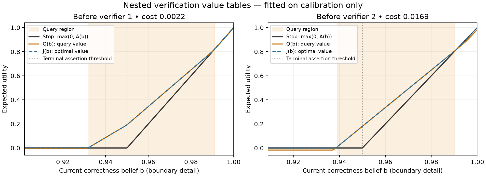
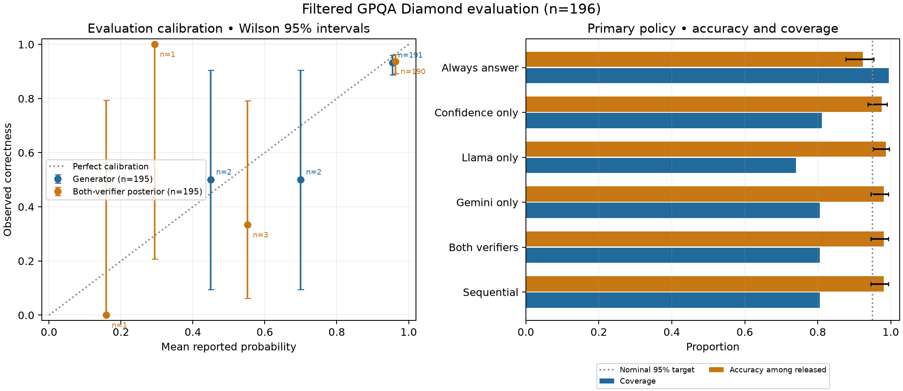

# Fresh GPQA experiment: live sequential verification

Completed 2026-10-04. Vertex APIs were called from the laptop; no VM or Jev was
used. This report contains aggregate results only. Questions, answer keys,
prompts and raw responses remain in ignored local directories.

## Main finding

The sequential policy released **158 answers, of which 155 were correct**.
It made the same release decisions as querying both verifiers, while using
**266 instead of 390 verifier calls** and **41.0% less estimated verifier spend**.

The evidence for improved answer selection over generator confidence alone is
limited: confidence-only selection already released 159 answers with 155
correct. Sequential verification removed one additional incorrect answer. The
paired utility improvement has a confidence interval crossing zero.

This validates execution of the fitted stopping policy and demonstrates savings
against the query-both baseline on this cohort. It does not establish a
general accuracy guarantee or incentive compatibility.

## Frozen design

| Component | Setting |
|---|---|
| Dataset | Official `Idavidrein/gpqa` on Hugging Face |
| Dataset revision | `83022cefff930aea54f654c0b282e74b9eeda5c6` |
| Calibration | Main excluding all original Diamond question IDs: 249 |
| Evaluation | Diamond after duplicate-choice exclusions: 196 |
| Split/choice seed | `20261004` |
| Generator | `google/gemini-3.8-flash` |
| First verifier | `meta/llama-3.3-70b-instruct-maas` |
| Second verifier | `google/gemini-3.7-flash` |
| Prior | Generator's elicited `p_correct` |
| Verifier model | Three score bins, Laplace smoothing; conditional independence |
| Primary utility | Correct release +1; wrong release −19; abstain 0 |
| Cost conversion | 10 utility units per USD |
| Primary verifier order | Llama, then Gemini; fixed before evaluation |

Three Main questions had duplicate answer choices, including two Diamond
questions. Applying the existing exclusion rule leaves 249 calibration and 196
evaluation questions, with no overlap. This is a filtered Diamond evaluation,
not a score on the complete official 198-question subset. Extended was checked
for membership consistency but was not used to fit or evaluate the policy.

The initial 50 calibration questions were a subject-stratified engineering
batch, and their responses were reused. All 445 generator responses were
collected once and frozen across policies. There were three format failures:
two in calibration and one in evaluation. They were retained in the cohort and
not regenerated. Likelihood fitting used 247 valid calibration candidates:
211 correct and 36 incorrect.

All likelihoods, expected query costs, policy scenarios and baseline definitions
were frozen before evaluation verifier requests. Live sequential evaluation
finished before collecting the remaining verifier responses needed for offline
baselines. Evaluation labels were used only in the subsequent scoring stage.
The generator, prompts and generation settings were unchanged.

## How the two algorithms were implemented

For correctness belief `b`, the value of releasing the fixed answer is
`A(b) = bR − (1−b)L`. Stopping has value `max(0, A(b))`, because abstention
has value zero. With `R=1` and `L=19`, the terminal assertion threshold is 0.95.

**Construct Nested Verification Value Tables:** estimate each verifier's
`P(signal bin | correct)` and `P(signal bin | incorrect)` on calibration data.
Work backwards over the fixed verifier order:

```text
J_after_last(b) = max(0, A(b))
Q_i(b) = −c_i + sum_z P_i(z | b) J_(i+1)(BayesUpdate_i(b, z))
J_i(b) = max(0, A(b), Q_i(b))
```

The implementation stores these tables on 1,001 belief points and uses linear
interpolation. Each layer contains one verifier. This is a numerical
implementation for a fixed order; it does not optimize arbitrary verifier
subsets or switch the candidate answer.

**Nested Sequential Verification:** start from the frozen generator confidence.
Query the next verifier only if its continuation value strictly exceeds the
value of stopping. Update the belief using that observed signal, save the state,
and repeat. Otherwise release or abstain. The live executor reads only the
selected verifier response and public candidate data. It has no evaluation
answer keys or access to future verifier outputs.

The cost is subtracted inside `Q_i(b)`, not added to a model prompt. Its expected
value is fitted from calibration token usage and frozen:

| Verifier | Mean calibration request estimate | Policy cost in utility units |
|---|---:|---:|
| Llama | $0.000218714 | 0.002187138 |
| Gemini | $0.001689701 | 0.016897014 |

The conversion of 10 utility units/USD means a correct release is valued at
$0.10 in this illustrative decision problem. That valuation is an application
choice, not an estimated property of the LLM. Generator cost is already incurred
when verification starts, so it is excluded from the stopping comparison and
included in total experiment spending. Policy utility below uses frozen expected
query costs; the accounting ledger separately records observed token estimates.
No generator reward model or parameter update is performed.



## Held-out results

Coverage uses all 196 evaluation questions as denominator. Accuracy uses released
answers. Invalid required inputs lead to abstention. Each single-verifier or
query-both baseline queries every valid candidate, then applies the same terminal
utility rule to its posterior.

| Policy | Released | Correct | Wrong | Coverage | Accuracy of released answers | Verifier calls | Mean utility |
|---|---:|---:|---:|---:|---:|---:|---:|
| Release every valid answer | 195 | 180 | 15 | 99.5% | 92.3% | 0 | −0.5357 |
| Confidence only | 159 | 155 | 4 | 81.1% | 97.5% | 0 | 0.4031 |
| Llama only | 145 | 143 | 2 | 74.0% | 98.6% | 195 | 0.5335 |
| Gemini only | 158 | 155 | 3 | 80.6% | 98.1% | 195 | 0.4832 |
| Both verifiers | 158 | 155 | 3 | 80.6% | 98.1% | 390 | 0.4810 |
| **Live sequential** | **158** | **155** | **3** | **80.6%** | **98.1%** | **266** | **0.4886** |

Generator answer accuracy over the entire evaluation cohort is 180/196 = 91.8%.
Always abstaining has zero coverage and zero utility.

The sequential, Gemini-only and query-both policies released the same item set.
Sequential verification used zero calls on 43 items (including the invalid
candidate), one call on 40 items, and two calls on 113 items. It saved **31.8% of
calls** relative to querying both. Although Gemini-only used fewer total calls,
its estimated spend was higher because Gemini calls were more expensive.

The sequential accuracy's Wilson 95% interval is **94.6%–99.4%**. The nominal
0.95 stopping threshold therefore does not establish an empirical guarantee of
at least 95% accuracy. The sequential-minus-confidence-only mean utility
difference is **+0.0855**, with paired bootstrap 95% interval
**[−0.0122, +0.2799]**. These intervals are descriptive and condition on the
fitted likelihood model. There are only 15 incorrect valid evaluation answers.

Llama-only has the highest observed mean utility, with lower coverage.
Sequential-minus-Llama-only utility is −0.0450, with interval
[−0.2722, +0.0775]. The results do not identify a statistically settled winner.
Predeclared lower-loss scenarios are saved as offline sensitivity analyses in
`report.json`; only the primary scenario was executed live.



## What the confidence signals tell us

Evaluation Brier scores below use the same 195 valid candidates; lower is better.

| Forecast | Brier score |
|---|---:|
| Calibration-set constant base rate | 0.07574 |
| Generator elicited confidence | 0.06107 |
| Llama's raw correctness score | 0.40513 |
| Generator prior updated with Llama likelihood | 0.06174 |
| Gemini's raw correctness score | 0.07190 |
| Generator prior updated with Gemini likelihood | 0.05986 |
| Generator prior updated with both likelihoods | 0.06034 |

The raw verifier score and its calibrated likelihood contribution are different
objects. Llama's raw `p_correct` is a poor probability forecast here, while its
empirical score distribution can still change a release decision. Neither its
score nor the generator's score is established as a model's true belief.
The small posterior improvements do not establish general calibration gains.
For example, the Gemini-update-minus-generator Brier difference has interval
[−0.00966, +0.00594], which includes zero.

Important limits:

- Only 36 incorrect calibration candidates inform the error-conditioned
  likelihoods. Empty or sparse score bins are sensitive to smoothing.
- Main-minus-Diamond and Diamond have different selection criteria and subject
  mixes. Likelihood transfer across them is an assumption.
- Conditional independence is assumed for both verifier signals and their
  relationship to the generator prior. Same-family models can share errors;
  different-family models can also be dependent. Error-conditioned score
  correlations were 0.282 on calibration and 0.230 on evaluation, with small
  sample sizes. These diagnostics neither establish nor rule out independence.
- Six evaluation priors are exactly 0 or 1; this Bayesian model cannot move them.
- The API names are managed aliases, not immutable weight revisions. Returned
  model identifiers and request settings were retained where provided.
- This is selective prediction using frozen model outputs. Strategic reporting,
  truthful incentives and generator learning have not been tested.

## Cost, billing project and recovery audit

The URL resource project and explicit quota-project header were both
`llm-applications-490420`. A preflight billing-information request confirmed an
attached billing account and `billingEnabled=true`. The Cloud Billing management
API was enabled to read that status; the billing account association was not
changed. All logged request project checks passed.

| Collection component | Successful requests | Token-based estimate |
|---|---:|---:|
| Generator, calibration | 249 | $0.564848 |
| Generator, evaluation | 196 | $0.472659 |
| Calibration verifiers | 494 | $0.471379 |
| Evaluation verifiers, including extra baseline signals | 390 | $0.403824 |
| **Total** | **1,329** | **$1.912709** |

Of evaluation verifier spending, the live policy used **$0.238445**, compared
with **$0.403824** for all evaluation verifier signals: a **40.95% reduction**.
This comparison excludes common generator and calibration expenses. Extra
baseline collection is included in the total experiment estimate.

The authorized cap was $200. Provider token usage, including reasoning tokens,
was reconciled for all 1,329 successful responses. There were 63 recorded HTTP
429 rejections and no unresolved attempts. Those rejected calls are reported
separately from priced successful responses. Costs use the saved pricing
snapshot; **no confirmed invoice or billing export has been obtained**. This is
an estimate of this experiment's usage, not a statement about the project's
total bill or other workloads.

Llama requests were serialized after capacity errors, with bounded backoff for
explicit 429 responses. Unknown transport outcomes are not silently retried.
During the pilot, remaining generator collection continued while four verifier
pairs awaited capacity. Calibration verifier collection later overlapped with
evaluation candidate generation. All calibration was complete and every policy
was sealed before evaluation verification or label-based scoring.

Validation:

- **200 tests passed; 4 dataset-dependent tests skipped.** One existing SciFact
  warning concerns truncating a rationale longer than three sentences.
- **445 distinct generator requests for 445 questions.** Adding verifiers and
  changing pricing metadata do not invalidate unchanged generator responses.
- **196/196 live and replay decisions matched**, including query count and
  posterior checks.
- A full offline resume made **zero provider attempts** and reproduced
  `report.json` byte for byte.
- Report SHA-256: `2be4cce7beac78f90d8f3e572a892ae23ba3c31f79d8e92652cc83c7fb765977`.

## Suggested next discussion

Keep this result and its candidates frozen. Before another collection, decide
whether the practical target is higher coverage at a fixed error rate or higher
expected utility at a specified monetary valuation. The current data support a
working stopping mechanism, while added verifier value remains uncertain.

A useful next offline study would compare a calibration-fitted generator prior,
the present likelihood update and a dependence-aware combination, with model
selection confined to calibration data. Evaluate proposed changes as exploratory
on this now-observed Diamond set, then reserve independent data for confirmation.
The cheap Llama-only baseline should remain in that comparison. Jev is deferred.

## Reproduction and artifacts

- [Frozen configuration](../configs/gpqa_vertex_fresh.json)
- [Protocol and commands](../docs/gpqa-fresh-vertex.md)
- [Aggregate audit](gpqa_fresh_vertex_20261004/audit.json)
- [Value-table SVG](gpqa_fresh_vertex_20261004/value_tables.svg)
- [Evaluation SVG](gpqa_fresh_vertex_20261004/evaluation.svg)

Detailed local artifacts are under `results/gpqa_vertex_20261004/`, including
source/split manifests, frozen candidates, calibration records, policy tables,
live item states, usage logs, `report.json` and `audit.json`. They are not tracked
in Git. The complete experiment can be resumed without network calls by omitting
`--allow-api`:

```sh
.venv/bin/python -m vgx.gpqa.experiment \
  --root results/gpqa_vertex_20261004 \
  --config configs/gpqa_vertex_fresh.json --phase complete
```

Dataset and pricing references:
[official GPQA data](https://huggingface.co/datasets/Idavidrein/gpqa),
[subset definitions](https://arxiv.org/html/2311.12022v1#S2.SS3),
[Google pricing](https://cloud.google.com/gemini-enterprise-agent-platform/generative-ai/pricing).
