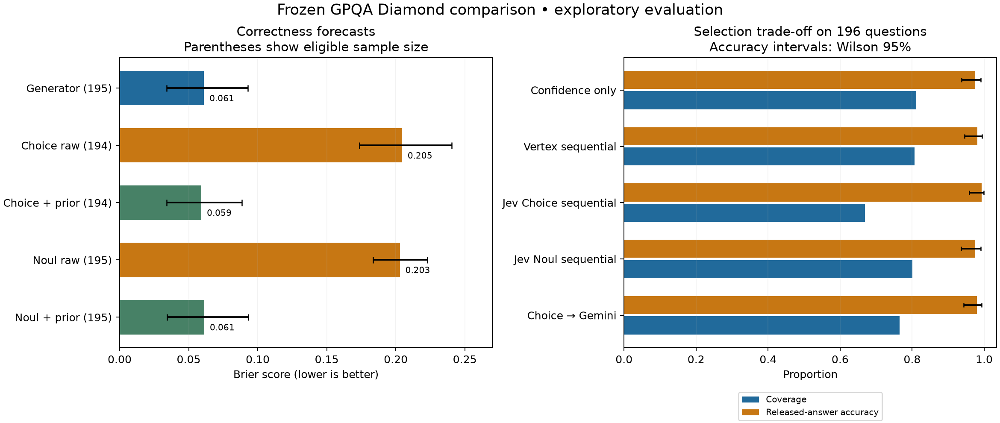

# Jev comparison on frozen GPQA candidates

Completed 2026-10-04. Jev authentication succeeded. The comparison used
`jev-1.13.0` and the existing frozen generator answers. **No new generator or
Vertex requests were made.** Total Jev token-based estimated spending was
**$0.02240322** (about 2.2 cents), within the separate $10 Jev budget.
No invoice or account-credit deduction was obtained.

## What we learned

Jev Choice provides a cheap, selective verification signal in this experiment.
The primary sequential policy released **131 answers, with 130 correct**, using
**45 Jev requests**. Higher observed accuracy came with lower coverage.

Compared with generator-confidence selection, it removed 28 answers: **25
correct and 3 incorrect**. With an incorrect-release penalty of 19 and a
correct-release reward of 1, that trade-off increased observed mean utility.
The paired uncertainty interval includes zero, so added value is not established.

Jev's raw probabilities were substantially worse correctness forecasts than the
generator's elicited confidence. The favorable selection result came from using
calibration-fitted Jev likelihoods to update the generator prior. These results
do not support interpreting the raw Jev probability as guaranteed calibration
on GPQA, or as evidence of an LLM's true belief.

## Design and execution

- Same cohort as the Vertex study: **249 Main-minus-Diamond calibration
  questions + 196 filtered Diamond evaluation questions**.
- Same generator, prompts, answer options and candidate answers. Three generator
  format failures remain in the cohort: two calibration and one evaluation.
- Jev Choice asks which option is correct and returns a probability for every
  option. We extract the probability of the frozen generator answer, regardless
  of Jev's preferred option. Jev's separate `confidence` field is not used.
- Jev Noul asks whether the fixed generator answer is correct and returns a yes
  probability. Choice and Noul are separate arms and are never chained as
  independent evidence.
- Ten valid calibration candidates formed the initial 20-response engineering
  batch. Their cached responses were reused in the full collection.
- Calibration likelihoods and expected costs were frozen before Jev evaluation
  calls. The primary Choice sequential run completed before secondary runs and
  extra evaluation signals were collected for offline baselines.
- Every sequential decision could access only its selected verifier response.
  Evaluation labels were read in the subsequent offline scoring stage.
- Secondary Choice→Gemini reused saved Gemini responses. Its logical query cost
  includes those requests; its incremental new Gemini spending was zero.

The utility is unchanged: correct release +1, wrong release −19, abstention 0,
and **10 utility units/USD**. Expected costs come from calibration usage and are
fixed during evaluation. Costs enter the continuation value `Q(b)`; they are
not added to the generator prompt. Generator learning is outside this experiment.

This Diamond cohort was already examined during the Vertex study. All Jev
comparisons here are **exploratory**, despite maintaining calibration/evaluation
separation within this collection.

## Primary policy comparison

Accuracy is among released answers; coverage uses all 196 evaluation questions.
Mean utility uses frozen expected query costs. Verifier counts are logical
requests, including reused responses in the hybrid arm.

| Policy | Released | Correct | Wrong | Coverage | Accuracy | Verifier queries | Mean utility |
|---|---:|---:|---:|---:|---:|---:|---:|
| Generator confidence only | 159 | 155 | 4 | 81.1% | 97.5% | 0 | 0.4031 |
| Original Llama-only baseline | 145 | 143 | 2 | 74.0% | 98.6% | 195 | 0.5335 |
| Original Llama→Gemini sequential | 158 | 155 | 3 | 80.6% | 98.1% | 266 | 0.4886 |
| **Jev Choice sequential — primary** | **131** | **130** | **1** | **66.8%** | **99.2%** | **45** | **0.5663** |
| Jev Noul sequential — secondary | 157 | 153 | 4 | 80.1% | 97.5% | 45 | 0.3928 |
| Jev Choice→Gemini — secondary | 150 | 147 | 3 | 76.5% | 98.0% | 260 | 0.4498 |

Choice's released-accuracy Wilson 95% interval is **95.8%–99.9%**, based on one
error among 131 releases. The paired mean utility difference against confidence
only is **+0.1632**, with bootstrap 95% interval **[−0.1252, +0.4980]**.
The precision estimate is encouraging, but neither a deployment guarantee nor
evidence that the policy is best across other cohorts or utility valuations.

The primary policy used zero verifiers for 151 items and one for 45. Querying
Choice on every valid evaluation candidate gives the same aggregate release
counts with 195 queries. The sequential policy saved **76.9% of those calls**.
The comparison against the original two-verifier policy has a different
accuracy/coverage trade-off and should not be described as equal-quality savings.

Noul removed two correct answers and no incorrect answers relative to confidence
only. Choice→Gemini removed eight correct and one incorrect. Neither secondary
arm demonstrated an advantage over the original Vertex sequential result here.

## Raw probability versus calibrated evidence

Lower Brier score is better. The Choice strict-parser cohort has 194 eligible
evaluation forecasts; Noul and the generator have 195. Paired comparisons use
the same eligible items for both forecasts.

| Forecast | Eligible evaluation items | Brier score |
|---|---:|---:|
| Generator elicited confidence | 195 | 0.06107 |
| Jev Choice raw probability | 194 | 0.20457 |
| Generator prior + Choice likelihood | 194 | 0.05918 |
| Choice score-only logistic calibration | 194 | 0.07355 |
| Jev Noul raw probability | 195 | 0.20294 |
| Generator prior + Noul likelihood | 195 | 0.06129 |
| Noul score-only logistic calibration | 195 | 0.07542 |

Choice's likelihood-update-minus-generator paired Brier difference is −0.00189,
with interval [−0.00686, +0.00229]. This is a small, uncertain improvement.
Raw Choice and Noul probabilities both have substantially worse Brier scores
than the generator on matched items. The score-only logistic fits improve the
raw signals but do not outperform the generator's forecast in this run.

A direct raw-probability policy—query Jev for every valid candidate and release
when its score is at least 0.95—releases only 49 answers for Choice (48 correct)
and two for Noul (both correct). Noul's 100% on two releases is not meaningful
evidence of reliable high-confidence performance.

## Rounded probabilities: preserved live result and offline sensitivity

Eight Choice responses returned four probabilities summing to **0.99**:
seven calibration and one evaluation. The original parser required the sum to
be within 0.000001 of one. These rows were marked invalid, with no replacement
requests. The sealed Choice likelihood therefore used 240 calibration signals
(204 correct candidates and 36 incorrect); its cost estimate used all 247
calibration responses. Noul used all 247 signals.

The provider documentation describes probabilities summing to one. The observed
deviations are consistent with rounding to two decimals, but full-precision
probabilities were not available. Two explicitly post hoc offline variants were
checked:

1. Accept the reported candidate marginal when all four entries have two-decimal
   precision and total-mass error is at most 0.02.
2. Apply the same bounded acceptance rule and divide each probability by the
   reported total mass.

Both recover seven calibration and one evaluation signal. After refitting on
calibration only, both give the same **131 releases, 130 correct and 45 queries**
as the original primary result. Their updated Brier scores are 0.05954 and
0.05919, respectively, on all 195 valid evaluation candidates. These are
counterfactual sensitivity analyses, not newly executed live policies. The
original responses, strict parser and sealed live policies remain unchanged.

## Accounting and software validation

The [official Jev model page](https://docs.typesafe.ai/models), checked on
2026-10-04, lists $0.042 per million input tokens and free output tokens.

| Collection | Successful Jev requests | Input tokens | Estimated cost |
|---|---:|---:|---:|
| Calibration, both modes | 494 | 291,625 | $0.01224825 |
| Evaluation, including extra baseline signals | 390 | 241,785 | $0.01015497 |
| **Total** | **884** | **533,410** | **$0.02240322** |

The primary live Choice selection cost **$0.001430688** for its 45 requests.
The whole comparison cost includes both modes and all extra baseline signals.
All 884 successful requests returned the pinned `jev-1.13.0` model identifier;
all usage was priced. There were no rejected or unresolved inference attempts.

The Jev ledger reserves a full 64k-token input allowance before each request and
serializes paid calls. It blocks on insufficient budget, missing usage, unknown
outcomes or rejections. It does not change the provider's account spending limit,
and no actual credit balance or confirmed invoice was retrieved.

Changes and checks:

- Added a Jev-only budget guard, local credential loader, and resumable comparison
  runner with a cache-only boundary for Vertex requests.
- Added a separate offline rounding-sensitivity module; no live parser change.
- Fixed execution ordering in accounting aggregation after a cross-process
  resume exposed tiny floating-point differences. Repeated offline execution
  now reproduces the final report byte for byte.
- **209 tests passed; 4 dataset-dependent tests skipped.** One existing SciFact
  warning concerns truncating rationales longer than three sentences.
- Live/replay decisions matched on **196/196 items for each of three arms**.
- Offline resume made **zero provider attempts**. All 884 request keys are
  distinct; there were no duplicate paid executions.
- The original Vertex report is unchanged, and the key was absent from call logs.

## Next discussion

Choice is worth studying as a low-cost evidence source under a high error penalty.
Keep the generator and original Vertex comparison available. The next decision
is how much coverage we are willing to give up to prevent incorrect releases.
Before claiming general benefit, select a rounding rule and calibration method
using development data, freeze them, and confirm on independent questions.

## Artifacts

- [Protocol and runnable commands](../docs/gpqa-jev-comparison.md)
- [Configuration](../configs/gpqa_jev_comparison.json)
- [Aggregate audit](gpqa_jev_comparison_20261004/audit.json)
- [Figure SVG](gpqa_jev_comparison_20261004/comparison.svg)
- [Original Vertex result](gpqa_fresh_vertex_20261004.md)

Detailed local artifacts: `results/gpqa_jev_20261004/`, including `report.json`,
`arm_reports/`, `policies/`, `live/`, `usage_estimate.json`, `audit.json` and
`rounding_sensitivity.json`. Raw questions, keys and responses remain ignored
by Git. The API key remains in the ignored local `.env` with owner-only access.
