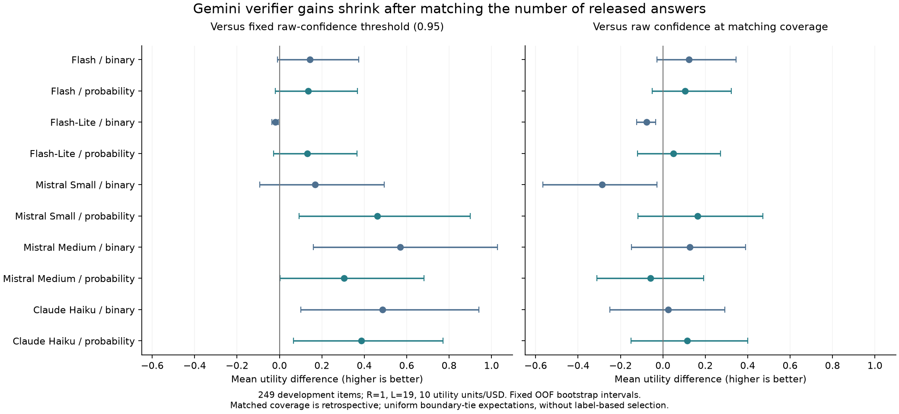

# 同等覆盖率下，verifier 是否提供额外价值？

日期：2026-10-06。此分析补充原始 confidence 实验，保留全部历史结果；不调用 API、不读取 Diamond 答案、不校准初始概率。

## 主要结论

在 Gemini 全部 249 道开发题的主设定下，先前相对固定 0.95 门槛的若干大幅收益，在匹配输出数量后明显缩小。十个实验臂中，没有一个正向效用差的描述性 95% 区间完全高于零。现有证据仍不足以确认 verifier 比仅按原始 confidence 筛选更好；这也不证明 verifier 没有价值。

## 比较方法



对每个验证折、每个 verifier 策略，先记录该策略输出 k 个答案。对照组从同一验证折的有效候选中，按原始 generator confidence 从高到低选 k 个；不支付 verifier 成本。候选、折分和输出数量均匹配。原有策略决定、概率和似然不变。

当第 k 名落在同分组内，对该组做均匀随机选择的期望计算。例如，同分组有 10 题、只剩 4 个名额，则每题输出权重为 0.4。权重仅由 confidence 与名额决定，正确答案只在选取权重后用于评分。表中的小数错误数是随机选取的期望，不是实际生成了小数个答案。

这是事后的风险—覆盖率诊断：k 来自已经执行的验证策略，因此不能直接当成已训练好、可独立部署的 confidence 门槛。它回答的是：在相同输出量下，验证策略是否比优先输出高 confidence 答案更会挑选。

奖励 R=1，错误惩罚 L=19，成本系数 10 效用单位/USD。效用差＝verifier 策略（含预期查询成本）−同覆盖率 confidence 对照。正数支持额外价值。

## 全部 249 道开发题

| Verifier 信号 | 输出数 | confidence 对照的期望错误数 | verifier 的错误数 | 平均效用差 | 描述性 95% 区间 | 五种折分的差值范围 |
|---|---:|---:|---:|---:|---|---|
| Claude Haiku 二元 | 152 | 11.35 | 11 | +0.0243 | [-0.2501, +0.2915] | [+0.0072, +0.0336] |
| Claude Haiku 概率 | 168 | 14.53 | 13 | +0.1157 | [-0.1502, +0.3997] | [+0.0938, +0.1243] |
| Gemini Flash 二元 | 188 | 18.65 | 17 | +0.1238 | [-0.0287, +0.3448] | [+0.1093, +0.1244] |
| Gemini Flash 概率 | 187 | 18.45 | 17 | +0.1036 | [-0.0510, +0.3227] | [+0.0832, +0.1036] |
| Flash-Lite 二元 | 186 | 18.08 | 19 | -0.0766 | [-0.1242, -0.0340] | [-0.0809, -0.0012] |
| Flash-Lite 概率 | 184 | 17.66 | 17 | +0.0487 | [-0.1186, +0.2716] | [-0.0338, +0.0589] |
| Mistral Medium 二元 | 152 | 11.58 | 10 | +0.1262 | [-0.1479, +0.3903] | [-0.3364, +0.1262] |
| Mistral Medium 概率 | 166 | 13.27 | 14 | -0.0590 | [-0.3108, +0.1920] | [-0.2380, -0.0355] |
| Mistral Small 二元 | 152 | 11.44 | 15 | -0.2861 | [-0.5664, -0.0285] | [-0.3116, +0.0919] |
| Mistral Small 概率 | 165 | 14.04 | 12 | +0.1633 | [-0.1185, +0.4708] | [+0.1538, +0.1782] |

## 排除最初 50 题后的 199 道开发题

| Verifier 信号 | 输出数 | confidence 对照的期望错误数 | verifier 的错误数 | 平均效用差 | 描述性 95% 区间 | 五种折分的差值范围 |
|---|---:|---:|---:|---:|---|---|
| Claude Haiku 二元 | 123 | 6.70 | 5 | +0.1671 | [-0.0728, +0.4252] | [+0.1058, +0.1671] |
| Claude Haiku 概率 | 135 | 8.52 | 7 | +0.1456 | [-0.0999, +0.4470] | [+0.1340, +0.1787] |
| Gemini Flash 二元 | 150 | 10.84 | 10 | +0.0768 | [-0.0246, +0.2663] | [+0.0726, +0.0782] |
| Gemini Flash 概率 | 149 | 10.65 | 10 | +0.0531 | [-0.0571, +0.2503] | [+0.0456, +0.0606] |
| Flash-Lite 二元 | 149 | 10.68 | 11 | -0.0363 | [-0.0759, -0.0043] | [-0.0606, -0.0344] |
| Flash-Lite 概率 | 147 | 10.37 | 10 | +0.0306 | [-0.0897, +0.2128] | [-0.0388, +0.0319] |
| Mistral Medium 二元 | 124 | 6.76 | 7 | -0.0242 | [-0.2940, +0.2379] | [-0.0242, +0.1659] |
| Mistral Medium 概率 | 127 | 7.46 | 8 | -0.0552 | [-0.3744, +0.2682] | [-0.0552, +0.1849] |
| Mistral Small 二元 | 120 | 6.07 | 6 | +0.0072 | [-0.2347, +0.2309] | [-0.0252, +0.1076] |
| Mistral Small 概率 | 133 | 8.14 | 6 | +0.2150 | [-0.0277, +0.4944] | [+0.2125, +0.2592] |

## 如何理解变化

以 Claude Haiku 二元信号为例：原先与固定 0.95 门槛比较，平均效用提高约 0.486；但该策略仅输出 152 个答案，而原门槛输出 190 个。在同样输出 152 个的条件下，confidence 对照平均约 11.35 个错误，verifier 策略实际 11 个错误。扣除验证成本后，效用优势只剩约 0.024，区间跨零。原先的收益有相当部分与减少输出有关。

Flash 概率策略输出 187 个答案，错误 17 个；同覆盖率 confidence 对照的期望错误约 18.45 个。方向上有帮助，但效用差约 +0.104，区间仍跨零。

不能仅凭较高的输出正确率选 verifier，因为少输出一些题本身就可能提高正确率；这个对照用于排除这部分解释。

## 结果边界

- 所有比较来自同一批开发题，不是独立最终评估；199 题子集与 249 题分析重叠。
- 五种折分全部保留，主结果固定为种子 20261005。
- 置信区间对固定 OOF 差值进行 5,000 次题目重采样，不包含重新拟合、同分实际随机抽取或十臂选择的不确定性。
- 每折严格匹配覆盖率，因此两个策略即使总输出数相同，只要在各折分配不同，对照期望错误数也可能略有差别。
- 本轮新增 200 个逐策略匹配比较（2 个范围 × 5 种折分 × 2 个惩罚 × 10 臂），不是 200 个独立实验。
- Qwen 的补采结果完成后，将沿用原有似然与成本分析协议，另存新结果并做同样对照。

## 复现

```sh
.venv/bin/python -m vgx.gpqa.matched_coverage \
  --root results/gpqa_raw_prior_analysis_20261006 \
  --output results/gpqa_matched_coverage_20261006
```

逐题输出权重、匹配统计、全部折分与惩罚结果保存在输出目录；源结果文件哈希在分析前后保持一致。

比较标识：`200f9c12a6e97347420a619cf7e8ef89d7a5ce8bbda94665c0297851b17d28a8`。
