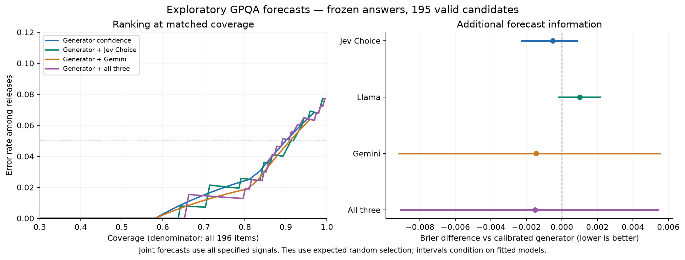
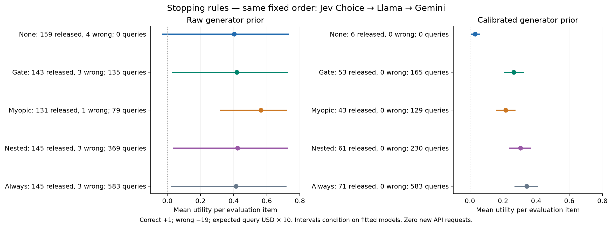
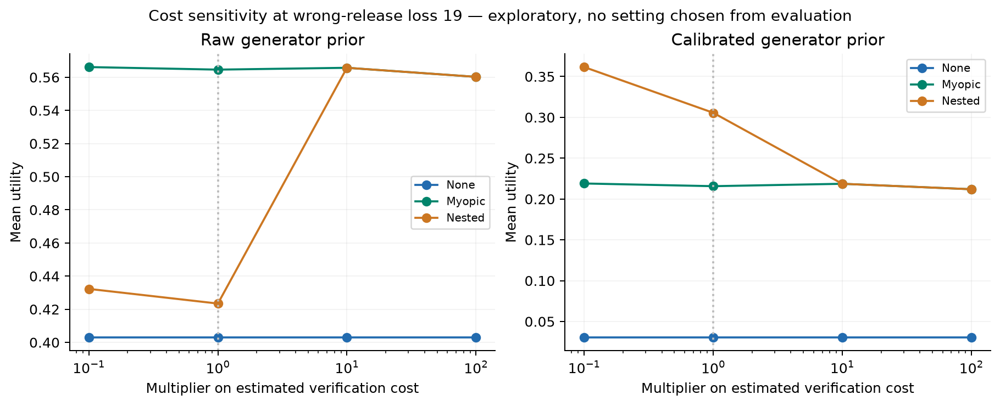
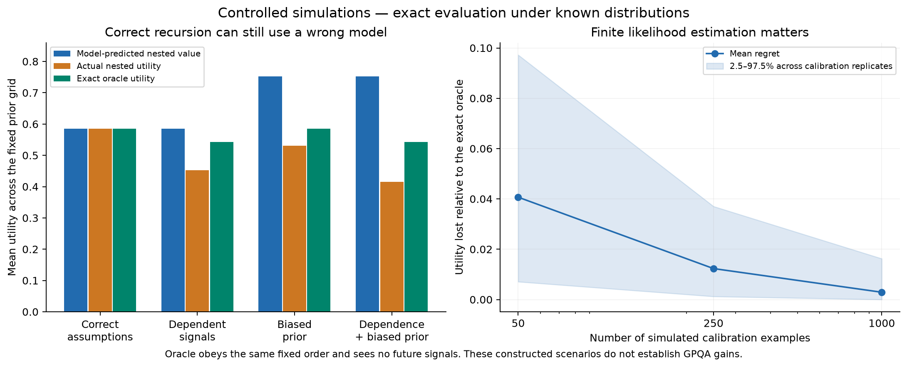

# GPQA: offline validation of confidence and nested stopping

Completed 2026-10-04. **Zero new API calls and zero new API spending.** All original
generator answers, prompts, responses and live policies remain frozen. This
study uses 249 calibration questions and 196 evaluation questions, with 247
and 195 valid generator forecasts respectively. Only **36 calibration** and
**15 evaluation** candidates are incorrect.

## Conclusion

The tested implementation behaves correctly in finite simulations where its
assumptions hold. The real-data evidence does **not establish a reliable benefit
from nested stopping over simpler rules**. Forecast improvements from adding
verifiers are small and uncertain. Recalibrating the generator prior changes
the stopping behavior sharply, without improving evaluation Brier score here.

The most useful next development target is the correctness prior and verifier
observation model, followed by independent confirmation of a frozen policy.
Increasing the number of verifier calls alone is not supported by these results.

All real-data results below are **exploratory**: this Diamond cohort has already
informed implementation and comparisons. Confidence intervals are descriptive,
without correction for the many comparisons or adaptive research decisions.

## 1. What did we test?

| Component | New check |
|---|---|
| Correctness forecast | Raw confidence, calibrated confidence, joint generator/verifier models, Bayesian updates |
| Verifier information | Paired Brier/log-loss differences and matched-coverage comparisons |
| Algorithm 1: value tables | Grid approximation versus an exact finite-tree oracle |
| Algorithm 2: stopping | No verification, always query, uncertainty gate, myopic VOI, nested lookahead |
| Calibration uncertainty | Refit likelihoods and priors in 200 calibration/evaluation bootstrap replicates |
| Model assumptions | Known independent signals, dependent signals, biased priors and finite calibration sets |

The primary new chain is **Jev Choice → Llama → Gemini**, with order fixed from
cheap to expensive. A separate order comparison and gate-width selection use
only calibration folds. Noul is a separate forecast diagnostic. These are new
offline comparisons, not replacements for the previously sealed live runs.

## 2. Do verifiers improve correctness forecasts?

All fits use calibration data only. Joint models use the same generator feature
as the calibrated-generator baseline, then add the listed verifier scores and
missingness indicators. Lower Brier score is better.

| Forecast | Calibration out-of-fold Brier | Evaluation Brier |
|---|---:|---:|
| Calibration base rate | 0.12451 | 0.07574 |
| Raw generator confidence | 0.12549 | 0.06107 |
| Calibrated generator | 0.11624 | 0.06110 |
| Generator + Jev Choice | 0.11875 | 0.06059 |
| Generator + Llama | 0.11594 | 0.06212 |
| Generator + Gemini | 0.11006 | 0.05965 |
| Generator + all three | 0.11234 | 0.05959 |

The all-three joint model improves evaluation Brier by **0.00151** over the
calibrated generator. The paired difference is −0.00151 with 95% bootstrap
interval **[−0.00911, +0.00541]**, conditional on the fitted models. With
calibration refitting, the interval is **[−0.01008, +0.00854]**. Both include zero.

Calibration improves the generator's calibration-fold Brier, but its evaluation
log loss worsens from **0.20362 to 0.22747**. Calibration and evaluation valid
candidate accuracies are **85.4% and 92.3%**, respectively. This is evidence that
the Main-minus-Diamond fit transfers imperfectly to Diamond in this sample;
the base-rate difference alone does not identify the cause.

No result here identifies an LLM's “true belief.” We assess predictions of
correctness and the decisions they support.

### Why the original Jev result is less decisive at matched coverage

The original Choice policy released 131 answers, with one error. Raw generator
confidence places **114 correct answers strictly above 0.95**, and another
**45 answers exactly at 0.95**, including four errors. To release 131 answers
at the same coverage, select 17 from that tied group.

Uniform random tie-breaking gives **1.51 expected errors**, versus the observed
one error with Jev. Its conditional 95% randomization range is **0–3 errors**;
a random selection has a **51.1% chance of at most one error** on this group.
This is a descriptive comparison on observed items, not a formal population
test. The apparently large 99.2% versus 97.5% accuracy difference compared
policies with substantially different coverage.

## 3. Does nested stopping add value?

All policies below use correct release +1, incorrect release −19, abstention 0,
and calibration mean verifier USD × 10 as query cost. Counts include all 196
evaluation questions; invalid candidates abstain without querying. The one
missing Jev signal costs a logical query if requested and then causes abstention.

### Original raw generator prior

| Policy | Released | Wrong | Coverage | Queries | Mean utility |
|---|---:|---:|---:|---:|---:|
| No verification | 159 | 4 | 81.1% | 0 | 0.4031 |
| Calibration-selected gate | 143 | 3 | 73.0% | 135 | 0.4190 |
| Myopic: value of next query only | 131 | 1 | 66.8% | 79 | 0.5646 |
| **Nested: value of remaining sequence** | **145** | **3** | **74.0%** | **369** | **0.4235** |
| Always query | 145 | 3 | 74.0% | 583 | 0.4145 |

Nested and always-query make exactly the same release/abstain decisions here.
Nested avoids **214 queries (36.7%)**. This demonstrates useful early stopping
relative to that baseline on these saved responses.

Against myopic, nested releases 14 additional answers: **12 correct and two
incorrect**, while adding 290 queries. At a penalty of 19 per error, its observed
mean utility is lower by **0.1412**, with paired interval **[−0.4484, +0.0677]**.
This does not establish which policy is better in the population.

The calibration-selected raw-prior order is Llama → Gemini → Jev Choice. It
releases the same 145 answers with three errors, uses 361 queries, and has
utility 0.4184. Changing the order did not resolve the empirical weakness here.

For context, the original **one-verifier Choice live policy** released 131
answers with one error using just 45 queries (utility 0.5663). The new myopic rule
has the same aggregate counts but a three-stage opportunity set; it is not that
original policy.

### Calibration-fitted generator prior

| Policy | Released | Wrong | Coverage | Queries | Mean utility |
|---|---:|---:|---:|---:|---:|
| No verification | 6 | 0 | 3.1% | 0 | 0.0306 |
| Calibration-selected gate | 53 | 0 | 27.0% | 165 | 0.2650 |
| Myopic | 43 | 0 | 21.9% | 129 | 0.2157 |
| **Nested** | **61** | **0** | **31.1%** | **230** | **0.3056** |
| Always query | 71 | 0 | 36.2% | 583 | 0.3431 |

Here nested releases 18 more correct answers than myopic, but the comparison is
highly sensitive to the calibration fit. The nested-minus-myopic utility interval
is **[+0.0548, +0.1299]** when conditioning on fitted models; after refitting
calibration it widens to **[−0.00021, +0.28479]**. Zero errors among 61 releases
has a released-accuracy Wilson interval of **94.1%–100%**, not a guarantee of
perfect accuracy.

The generator-only release count drops from **159 to six** after recalibration.
That large change, despite almost unchanged evaluation Brier, shows why global
forecast scores alone are insufficient for validating a high-confidence
stopping threshold. The calibrated variant is not an established improvement.

### Costs affect the stop point

Expected per-query USD from the frozen calibration policies is approximately
**$0.00002646 for Choice**, **$0.00021871 for Llama**, and **$0.00168970 for
Gemini**. These remain estimates from usage, not confirmed billing.

`A(b) = b − 19(1−b)` gives a release threshold of 0.95. Algorithm 1 computes
`Q_k(b) = −c_k + E[J_(k+1)(b')]`; Algorithm 2 queries only when `Q_k(b)` exceeds
`max(0, A(b))`. Prices change the continuation decision through `c_k`, not the
generator prompt or the terminal 0.95 threshold.

At **10× the query cost**, the raw-prior nested and myopic policies both reduce
to 45 queries, 131 releases and one error. At the original cost they differ
sharply. These sensitivity settings were listed in the analysis configuration;
we do not choose a valuation because it happens to score well on Diamond.

All policy costs are expected deployment costs of logical queries. Replaying
the saved responses spent no money. The common frozen generator cost is omitted
from incremental verification comparisons.

## 4. What do the simulations establish?

The oracle knows the true distribution and sees observations sequentially. It
does not know the hidden correctness or future signals. It follows the same
fixed verifier order, with no skipping of stages.

| Constructed scenario | Model-predicted nested value | Actual nested utility | Exact oracle utility |
|---|---:|---:|---:|
| Independent signals, correct prior | 0.5849 | 0.5849 | 0.5849 |
| Dependent signals, correct prior | 0.5849 | 0.4527 | 0.5426 |
| Independent signals, biased prior | 0.7525 | 0.5302 | 0.5849 |
| Dependent signals and biased prior | 0.7525 | 0.4150 | 0.5426 |

Values average over a fixed nine-point prior grid. The simulations illustrate
how a correctly implemented planner can overestimate verification value when
the prior or observation model is wrong. They do not diagnose the specific
cause of the empirical GPQA results.

Two additional controls pass:

- Uninformative verifiers with positive cost are never queried.
- In a fixed-order chain with an uninformative first verifier and useful second
  verifier, nested lookahead achieves utility **0.389** at prior 0.5; myopic stops
  with utility zero. This advantage relies on the stated no-skipping constraint.

### Numerical and finite-calibration checks

| Grid points | Maximum value error vs exact oracle | Maximum policy regret | Initial action disagreements |
|---|---:|---:|---:|
| 101 | 0.014609 | 0.012659 | 1 |
| 1,001 | 0.000005972 | approximately 0 | 0 |
| 10,001 | numerical roundoff | approximately 0 | 0 |

This check evaluates 101 priors in one independent three-verifier world. It is
not a universal error bound for the grid approximation.

With estimated likelihoods, mean regret relative to the oracle decreases from
**0.04068 at 50 calibration examples**, to **0.01231 at 250**, to **0.00290 at
1,000**. Each size uses 40 simulated calibration replicates and exact evaluation.
The corresponding mean numbers of incorrect calibration answers are only
6.75, 31.53 and 130.08. Calibration information depends on the number and
representativeness of errors, not just total question count.

## 5. Recommended next experiment

1. **Keep these results as development evidence.** Do not claim that Jev, raw
   confidence, calibrated confidence or nested stopping is the overall winner.
2. **Define the target question distribution and utility before collection.**
   Use disjoint, representative calibration and confirmation samples. If the
   target is Diamond-like questions, explicitly study Main-to-Diamond transfer.
3. **Improve and validate the decision inputs on development data.** Check
   high-confidence prior calibration, conditional signal dependence and whether
   likelihoods change with generator confidence. Compare low-capacity models;
   the current 36 calibration errors cannot support a large conditional table.
4. **Freeze one primary policy and simple baselines**, then confirm on untouched
   questions. Include no-verifier confidence, a single cheap verifier and
   myopic stopping. Choose sample size from a detectable paired utility effect
   and expected number of errors; do not declare success from zero observed
   errors on a small selected subset.

If additional error-focused examples are collected, keep that stress test
separate or correct for its sampling scheme. Selecting known wrong answers and
treating their frequency as a deployment prior would distort calibration.

Generator incentive compatibility, truthful reporting and generator learning
are not validated by the stopping simulations. Those mechanism-design questions
require separate experiments if they become part of the research claim.

## Validation and artifacts

- **238 tests passed; four dataset-dependent tests skipped.** One pre-existing
  SciFact warning concerns truncating rationales longer than three sentences.
- 29 new focused tests cover calibration-only fitting, label-free prediction,
  no future-signal access, attempted-query costs, tied coverage, exact oracles,
  grid convergence and deterministic end-to-end execution with network blocked.
- All 200 refit bootstrap replicates and 120 simulated calibration fits
  completed. Original input hashes remain unchanged.
- A second full offline run reproduced the report, protocol, calibration
  selection and per-item decisions byte for byte. Both original provider-run
  reports also retain their previous hashes.
- [Protocol and commands](../docs/gpqa-offline-validation.md)
- [Analysis configuration](../configs/gpqa_offline_validation.json)
- [Aggregate machine-readable results](gpqa_offline_validation_20261004/aggregate.json)
- [Reproducibility audit](gpqa_offline_validation_20261004/audit.json)
- [Original Jev comparison](gpqa_jev_comparison_20261004.md)

Private records and per-item decisions remain under
`results/gpqa_offline_validation_20261004/`. Figures are available as PNG and SVG
in the adjacent report directory.
