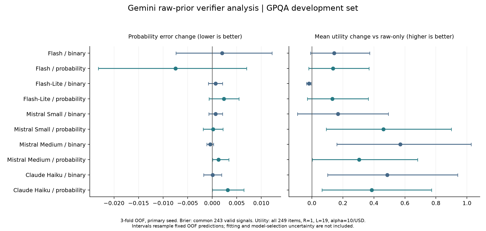

# 原始 confidence 与 verifier 似然更新的离线实验

完成日期：2026-10-06。此报告是 12 页阶段报告之后的新实验补充；旧报告及历史校准分析保持原样。

## 结论

本轮已在 Gemini 的 249 道开发题上完成 5 个 verifier × 2 种信号的原始 prior 分析，没有校准 generator confidence、重新生成候选或调用模型 API。Qwen 因缺 758 个请求而阻塞，未在有偏缓存子集上拟合似然或给出模型排名。

Flash 概率信号仍是平均概率误差上最有希望的候选，但其 Brier 改善区间包含零。概率误差改善与顺序停止效用并不一致：某些二元信号在输出阈值附近触发弃答，减少了错误释放；这不足以证明概率模型更准确。主设定下，全体 249 题上的每个单 verifier 策略平均效用仍为负，低于全部弃答的零效用。因此不能宣布当前策略已经适合使用，也不能只凭本轮选出最终三个 verifier。

## 固定协议

- 原始 `p_correct` 原样作为 b0，保留 0／1 端点；不做逻辑回归、初始概率校准、基准正确率替代或静默裁剪。
- 三折分层交叉验证，固定主种子 20261005，另外四个既定种子 20261006–20261009 做敏感性检查，不选最优种子。
- 只在训练折估计 P(信号区间|候选正确／错误)。二元信号 2 箱，概率信号 3 个等宽箱，Laplace=1。验证题不参与其自身似然或成本估计。
- 同一模型的二元与概率报告是独立实验臂，不作为两次独立证据串联。每个实验臂只有一个固定 verifier，使用已有 NestedPlanner 构表与停止；未选择三 verifier 顺序。
- 正确奖励 R=1；主错误惩罚 L=19；L=99 为敏感性条件；alpha=10 效用单位/USD。没有根据本轮结果改阈值。
- 每个训练折的预期成本来自该折全部已返回响应的用量估算，包含付费但解析失败的响应。验证题实际 token 用量不进入调用决策。
- 概率比较采用同题配对，主横向表取十个实验臂都有效的 243 题；各臂匹配样本另存在 JSON。策略分母采用全部 249 题，包括 2 个无有效初始答案／confidence 的题目。
- 缺失请求与已返回无效信号不同：缺请求阻塞完整 generator 分析；已返回无效信号保留，被查询时弃答。没有把缺失视为 0 或补发请求。
- 另在去掉最初 50 道协议试验题的 199 题上重新分折，训练与评分均不含试验题。

基线为原始概率直接输出／弃答；另计算强制询问一个 verifier 和根据 Q 决定是否询问的顺序策略。似然、预期成本与所有决定保存到逐折结果。



## 1 概率预测是否改善

共同有效样本 n=243。未更新的原始概率 Brier 为 **0.124579**。差值定义为更新后减去原始值，负数为改善。以下更新是假设取到该 verifier 信号时的预测比较，尚不包含 Q 的选择。

| Verifier 信号 | 更新后 Brier | 差值 | 描述性 95% 区间 | 五种折分的差值范围 |
|---|---:|---:|---|---|
| Flash 二元 | 0.126609 | +0.002030 | [-0.0074, 0.0122] | [+0.000958, +0.002814] |
| Flash 概率 | 0.117108 | -0.007472 | [-0.0232, 0.0070] | [-0.008890, -0.005288] |
| Flash-Lite 二元 | 0.125248 | +0.000668 | [-0.0008, 0.0021] | [+0.000668, +0.004291] |
| Flash-Lite 概率 | 0.126980 | +0.002400 | [-0.0006, 0.0055] | [+0.002400, +0.004523] |
| Mistral Small 二元 | 0.125258 | +0.000678 | [-0.0007, 0.0021] | [-0.000087, +0.001173] |
| Mistral Small 概率 | 0.124742 | +0.000163 | [-0.0019, 0.0022] | [+0.000015, +0.001439] |
| Mistral Medium 二元 | 0.124187 | -0.000392 | [-0.0011, 0.0003] | [-0.000463, +0.002446] |
| Mistral Medium 概率 | 0.125885 | +0.001306 | [0.0001, 0.0034] | [+0.000225, +0.004073] |
| Claude Haiku 二元 | 0.124686 | +0.000107 | [-0.0018, 0.0019] | [+0.000107, +0.000760] |
| Claude Haiku 概率 | 0.127762 | +0.003183 | [0.0001, 0.0065] | [+0.001449, +0.003221] |

Flash 概率信号的改善在五种折分下方向一致，但题目配对区间仍跨零。Flash 二元信号没有对应的 Brier 改善。其他概率信号在主共同样本上没有改善，不能把“有中间概率”直接等同于“有价值的信息”。

这里只评价原始概率经既定似然更新后的效果，不是此前校准联合预测的重复。两轮基线、更新方法与样本口径不同，不能直接用两个最终 Brier 数字比较优劣。

## 2 顺序停止决策结果

主设定 R=1、L=19、alpha=10。覆盖率分母为全部 249 题；输出正确率只针对输出答案。平均效用 =（正确输出数 − 19×错误输出数 − 10×预期逻辑验证美元成本）/249。未输出收益为零。

| 策略 | 输出数 | 正确／错误 | 覆盖率 | 输出正确率 | 查询数 | 平均效用 | 相对 raw 效用差 |
|---|---:|---|---:|---:|---:|---:|---:|
| 原始 confidence 基线 | 190 | 171 / 19 | 76.3% | 90.0% | 0 | -0.7631 | +0.0000 |
| Flash 二元 | 188 | 171 / 17 | 75.5% | 91.0% | 130 | -0.6189 | +0.1442 |
| Flash 概率 | 187 | 170 / 17 | 75.1% | 90.9% | 188 | -0.6270 | +0.1360 |
| Flash-Lite 二元 | 186 | 167 / 19 | 74.7% | 89.8% | 43 | -0.7817 | -0.0186 |
| Flash-Lite 概率 | 184 | 167 / 17 | 73.9% | 90.8% | 69 | -0.6311 | +0.1320 |
| Mistral Small 二元 | 152 | 137 / 15 | 61.0% | 90.1% | 69 | -0.5945 | +0.1686 |
| Mistral Small 概率 | 165 | 153 / 12 | 66.3% | 92.7% | 125 | -0.3014 | +0.4617 |
| Mistral Medium 二元 | 152 | 142 / 10 | 61.0% | 93.4% | 69 | -0.1931 | +0.5699 |
| Mistral Medium 概率 | 166 | 152 / 14 | 66.7% | 91.6% | 85 | -0.4583 | +0.3047 |
| Claude Haiku 二元 | 152 | 141 / 11 | 61.0% | 92.8% | 69 | -0.2767 | +0.4863 |
| Claude Haiku 概率 | 168 | 155 / 13 | 67.5% | 92.3% | 69 | -0.3766 | +0.3865 |
| 全部弃答参照 | 0 | 0 / 0 | 0% | 不适用 | 0 | 0 | +0.7631 |

**所有单 verifier 策略在这批 249 题上的平均效用仍低于零。** 某些策略相对原始 confidence 基线改善，但不能因此认为它们已经优于不输出任何答案。全部弃答牺牲所有覆盖率，这说明当前效用设定下仍需要建立可信的高正确率输出区域。

Flash 概率信号查询 188 次，输出 187 个答案，其中 170 正确、17 错误；基线输出 190 个，其中 171 正确、19 错误。其平均效用改善约 +0.1360，95% 描述区间为 [-0.0206, +0.3686]，尚未确认增益。

Mistral Medium 二元信号在主折分有更大效用改善，但五种折分的改善范围约 +0.0318 至 +0.5699，表现不稳定。Claude 二元与 Mistral Medium 二元在主折分都只查询原始 p=0.95 的 69 个候选。因为 p=0.95 正好位于 R=1、L=19 的无差异点，微小的概率下降就会改变输出决定。这解释了为什么全局 Brier 几乎不变，停止效用却可以明显变化。

因此，后续应加入相同覆盖率下只按原始 confidence 选择的对照，区分 verifier 的定向纠错价值与简单减少输出带来的收益。本报告没有据此事后调阈值或挑选胜出模型。

### 查询成本与强制查询对照

以下美元均为本地历史用量推算，不是本轮新增消费或确认账单。预期成本按训练折冻结；用量成本按策略实际选择的缓存响应推算，属于反事实执行成本。所有策略的 generator 成本相同，停止比较中为沉没成本。

| Verifier 信号 | 顺序预期成本 USD | 顺序用量成本估算 USD | 强制查询数 | 强制查询平均效用 |
|---|---:|---:|---:|---:|
| Flash 二元 | 0.209753 | 0.194730 | 247 | -0.6265 |
| Flash 概率 | 0.313054 | 0.277229 | 247 | -0.6310 |
| Flash-Lite 二元 | 0.063585 | 0.062595 | 247 | -0.7940 |
| Flash-Lite 概率 | 0.113547 | 0.108882 | 247 | -0.6508 |
| Mistral Small 二元 | 0.002158 | 0.002220 | 247 | -0.5947 |
| Mistral Small 概率 | 0.004422 | 0.004515 | 247 | -0.3016 |
| Mistral Medium 二元 | 0.009001 | 0.009215 | 247 | -0.1941 |
| Mistral Medium 概率 | 0.012531 | 0.012652 | 247 | -0.4593 |
| Claude Haiku 二元 | 0.090154 | 0.062396 | 247 | -0.2860 |
| Claude Haiku 概率 | 0.176641 | 0.143085 | 247 | -0.3989 |

### 更高错误惩罚

设 L=99 时，原始基线只输出 65 个答案，62 正确、3 错误，平均效用 −0.9438。Flash 概率顺序策略查询 63 次，最终输出数与对错数均未变化，只增加成本。提高惩罚改变了决策区域，但并没有自动获得可靠收益。完整敏感性结果已存入 report.json。

## 3 去掉最初 50 题后的结果

在其余 199 题上重新拟合与验证，共同有效信号 n=193；原始 Brier=0.105351，Flash 概率更新后=0.096116，差值 −0.009234，95% 描述区间 [-0.026224, +0.005829]。五种折分均有方向一致的改善，仍不能确认统计稳定收益。

R=1、L=19 下，原始策略输出 151 个，140 正确、11 错误，平均效用 −0.3467。Flash 概率顺序策略输出 149 个，139 正确、10 错误，平均效用 −0.2690。Claude 二元与 Mistral Small 概率在这一子集的主折分平均效用分别为 +0.1118 和 +0.0651，表明结论会随题目范围与信号而变化，不能据此选择更有利的子集作为最终结果。

## 4 执行与数据完整性核对

- 完成两个开发集口径 × 五个折分种子的分析；全部种子均报告，没有选择最优值。
- 概率更新与策略预测均来自验证折；逐折保留训练题、验证题、似然拟合题和成本拟合题 ID，可复查交叉隔离。
- 44,400 次有效候选的懒加载顺序执行与已有 planner.replay 的动作、posterior、查询数一致。这是离线执行路径一致性核对，不是新一次真实 API 实时试验。
- 无效 generator 直接弃答；所需信号无效时弃答。未选中的信号没有通过决策的查询回调读取。
- 原始候选、源标签文件、所用缓存响应的哈希在分析前后未变。
- 没有读取 Diamond 答案键，没有调用 Jev、generator 或 verifier；本轮新增 API 消费为 $0。计费项目元数据仍为 llm-applications-490420，没有获取确认账单。

## 5 Qwen 的具体阻塞

Qwen 的 249 个冻结候选仍保留。十个实验臂合计缺 758 个唯一请求：Flash 概率和 Mistral Medium 概率各缺 63，其余八臂各缺 79。现有二元缓存常包含 152 个正确候选和 18 个错误候选，而 Qwen 全体有 157 个正确和 92 个错误候选，选择偏差明显。

本轮只做覆盖审计，没有在该子集上拟合完整似然，也没有把缺失请求算成 verifier 失败或自行补采。Qwen 完整比较需要在已有预算和计费项目约束下补齐缺失 verifier 请求；不需要重跑 generator，也不应替换已返回的无效信号。

## 6 解释边界与下一步

- 这些是经过前期模型筛选后的开发集结果，不能当作独立最终评估。
- 95% 区间来自 5,000 次固定 OOF 结果的题目重采样，不包含模型拟合、折分重叠和十臂选择的不确定性；不能作为多重比较校正后的胜出证明。
- 贝叶斯更新仍假设给定候选正确性后 verifier 信号与 generator confidence 独立；原始 prior 也没有经过概率准确性验证。没有校准不代表这个假设自然成立。
- 当前 Q 表枚举有效信号区间，没有显式建模返回格式失败的概率；实际回放保留失败并弃答。
- p=0 或 1 的原始端点不被普通有限似然改变，仍保留此性质。
- 先补齐 Qwen、增加相同覆盖率对照并检查依赖性，再决定信号形式和三 verifier 顺序；目前不发布新实时策略。

## 复现入口

```bash
.venv/bin/python -m vgx.gpqa.raw_prior_analysis \
  --config configs/gpqa_raw_prior_analysis.json \
  --output results/gpqa_raw_prior_analysis_20261006
```

协议：`configs/gpqa_raw_prior_analysis.json`。输出目录含 `protocol.json`、`coverage.json`、`report.json`，以及各 generator／cohort／seed 的逐题决定、逐折似然与成本。输出目录对协议和源文件哈希进行校验；改变配置或代码须使用新的目录，历史结果不得覆盖。

分析标识：`a12c6b050f40deba5b9028f15d8d55d91e8320bd86b4e46af2e75689a6592a45`。
